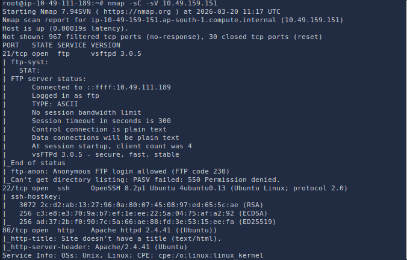
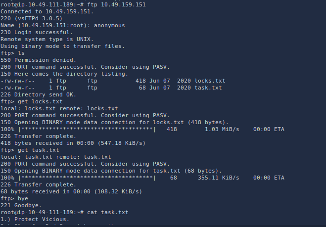
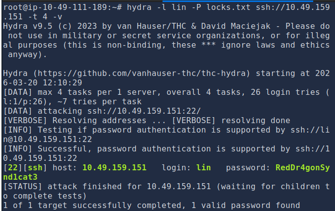
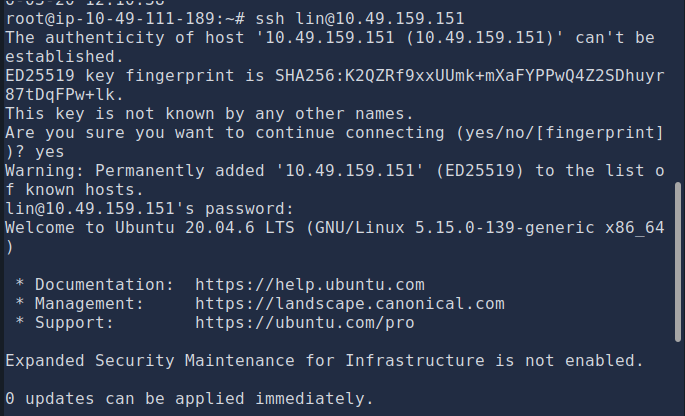
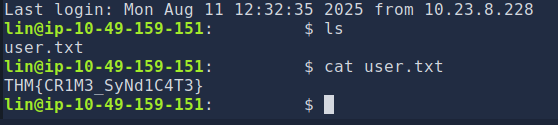
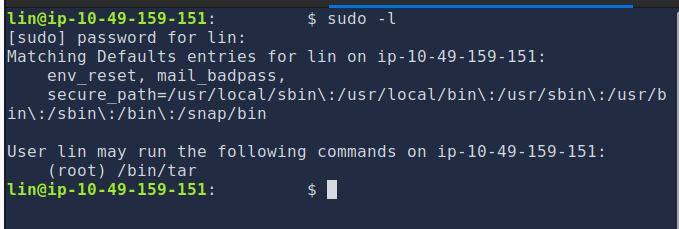
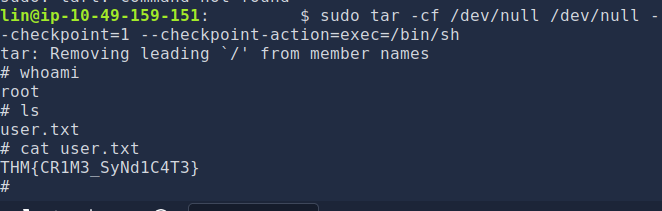
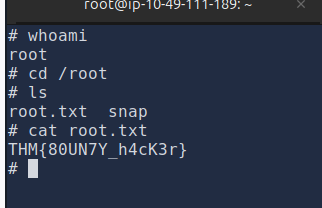

# Bounty Hacker — TryHackMe Write-up

[](https://tryhackme.com)
[](https://tryhackme.com)
[](https://tryhackme.com)

## Overview

This write-up documents a complete penetration test of the **Bounty Hacker** room on [TryHackMe](https://tryhackme.com/room/bountyhacker). The engagement follows a realistic attack workflow: network reconnaissance, service enumeration, credential discovery, initial access over SSH, and privilege escalation to root.

The lab reinforces foundational offensive security skills relevant to **SOC triage**, **junior penetration testing**, and **security operations** roles—mapping exposed services, correlating findings, and chaining misconfigurations into full system compromise.

---

## Lab Information

| Field | Details |
|-------|---------|
| **Room** | [Bounty Hacker](https://tryhackme.com/room/bountyhacker) |
| **Platform** | TryHackMe |
| **Target IP** | `<TARGET_IP>` (assigned per session) |
| **Attacker OS** | Kali Linux |
| **Objectives** | Gain user access, escalate to root, capture user and root flags |

---

## Skills Demonstrated

- Network scanning and service fingerprinting (**Nmap**)
- Anonymous FTP enumeration and artifact collection
- Password spraying / brute force against SSH (**Hydra**)
- Remote access via SSH with recovered credentials
- Linux privilege enumeration (`sudo -l`)
- Privilege escalation using **GTFOBins** (`tar` checkpoint abuse)
- Documentation of findings, impact, and remediation

---

## Tools Used

| Tool | Purpose |
|------|---------|
| **Nmap** | Port scanning and service/version detection |
| **FTP** | Anonymous login and file retrieval |
| **Hydra** | SSH credential brute force |
| **SSH** | Initial shell access |
| **GTFOBins** | `tar` privilege escalation technique reference |
| **Linux CLI** | Enumeration, flag discovery, post-exploitation |

---

## Reconnaissance

A service scan was performed to identify open ports and running services:

```bash
nmap -sC -sV <TARGET_IP>
```



### Findings

| Port | Service | Notes |
|------|---------|-------|
| **21/tcp** | FTP | Potential anonymous access |
| **22/tcp** | SSH | Remote shell if credentials are recovered |
| **80/tcp** | HTTP | Web service present; secondary enumeration possible |

### Analysis

- FTP may allow **anonymous authentication**, exposing files useful for password attacks.
- SSH is a likely **initial access vector** once valid credentials are identified.
- HTTP provides an additional attack surface for directory or content enumeration.

---

## Enumeration

### FTP (Anonymous Access)

The FTP service on port 21 permitted anonymous login:

```bash
ftp <TARGET_IP>
# Username: anonymous
# Password: anonymous
```



**Artifacts recovered:**

| File | Value |
|------|-------|
| `locks.txt` | Password wordlist for brute-force attacks |
| *(inferred)* | Username **`lin`** identified for SSH targeting |

`locks.txt` acted as a custom wordlist, reducing brute-force scope compared to a full dictionary attack.

---

## Exploitation

### SSH Credential Discovery (Hydra)

Credentials were recovered by brute-forcing SSH with the username `lin` and passwords from `locks.txt`:

```bash
hydra -l lin -P locks.txt ssh://<TARGET_IP>
```



| Username | Password |
|----------|----------|
| `lin` | `RedDr4gonSynd1cat3` |

### Initial Access

SSH access was established with the recovered credentials:

```bash
ssh lin@<TARGET_IP>
```



### User Flag

After successful authentication, the user flag was located and captured:



---

## Privilege Escalation

### Sudo Enumeration

The `lin` account was checked for elevated command permissions:

```bash
sudo -l
```



**Finding:** User `lin` may run **`/bin/tar` as root** without a password (NOPASSWD), creating a direct privilege escalation path.

### GTFOBins — `tar` Checkpoint Abuse

[GTFOBins](https://gtfobins.github.io/gtfobins/tar/) documents how `tar` can execute arbitrary commands via `--checkpoint-action`. The following command spawns a root shell:

```bash
sudo tar -cf /dev/null /dev/null --checkpoint=1 --checkpoint-action=exec=/bin/sh
```

### Root Flag

Root access was obtained and the root flag was captured:





---

## Key Takeaways

| Theme | Lesson |
|-------|--------|
| **Weak credentials** | Predictable passwords in `locks.txt` enabled rapid SSH compromise. |
| **Anonymous FTP** | Unauthenticated file access can leak usernames and password lists. |
| **Brute force exposure** | SSH without rate limiting or lockout is vulnerable to Hydra-style attacks. |
| **Sudo misconfiguration** | Allowing `tar` with checkpoint options effectively grants root execution. |
| **Attack chain** | Recon → enumerate → brute force → access → privesc mirrors real assessments. |

---

## Defensive Recommendations

- Enforce **strong password policies** and eliminate default or themed weak passwords.
- **Disable anonymous FTP** or restrict it to non-sensitive, read-only content.
- Deploy **fail2ban** or equivalent to limit SSH brute-force attempts.
- Audit **`sudoers`** entries; remove unnecessary NOPASSWD rules.
- Restrict or remove dangerous **SUID/sudo** allowances for archive utilities where possible.
- Monitor authentication failures and FTP access logs for anomaly detection (**SOC** relevance).

---

## Conclusion

The **Bounty Hacker** room demonstrates an end-to-end Linux penetration test: from **Nmap** reconnaissance through **FTP** and **Hydra** exploitation to **sudo/GTFOBins** privilege escalation. The engagement highlights how small misconfigurations—anonymous FTP, weak SSH credentials, and permissive sudo rules—combine into full system compromise.

These techniques map directly to internship and junior-role expectations: structured methodology, clear documentation, and actionable remediation guidance alongside offensive proof-of-concept steps.

---

*For educational purposes only. Only perform penetration testing on systems you own or are explicitly authorized to test.*
