# Kenobi — TryHackMe Write-up

[](https://tryhackme.com)
[](https://tryhackme.com)
[](https://tryhackme.com)

## Overview

This write-up documents a full penetration test of the **Kenobi** room on [TryHackMe](https://tryhackme.com/room/kenobi). The attack chain progresses from multi-protocol reconnaissance through SMB and NFS abuse, exploitation of a known **ProFTPD `mod_copy`** vulnerability, SSH key recovery, and final privilege escalation via **PATH hijacking** on a misconfigured SUID binary.

The room is well suited for portfolio work targeting **junior penetration testing**, **red team fundamentals**, and **SOC analyst** roles—emphasizing service enumeration, misconfiguration chaining, and Linux post-exploitation.

---

## Lab Information

| Field | Details |
|-------|---------|
| **Room** | [Kenobi](https://tryhackme.com/room/kenobi) |
| **Platform** | TryHackMe |
| **Target IP** | `<TARGET_IP>` (assigned per session) |
| **Attacker OS** | Kali Linux |
| **Objectives** | Enumerate services, gain user shell, escalate to root, capture flags |

---

## Skills Demonstrated

- Multi-service reconnaissance (**Nmap**)
- SMB share enumeration and log analysis (**smbclient**, `grep`)
- NFS export discovery and remote mount (**showmount**, `mount`)
- Exploitation of **ProFTPD 1.3.5 `mod_copy`** (CVE-2015-3306)
- SSH private key handling (`chmod 600`, key-based login)
- SUID binary discovery and **PATH hijacking**
- Risk-based remediation recommendations

---

## Tools Used

| Tool | Purpose |
|------|---------|
| **Nmap** | Port scan and service detection |
| **smbclient** | SMB share listing and file retrieval |
| **showmount / mount** | NFS export enumeration and mounting |
| **Netcat** | ProFTPD `SITE CPFR` / `SITE CPTO` interaction |
| **grep** | Log filtering for service/version intel |
| **SSH** | Initial access with recovered private key |
| **find** | SUID binary enumeration |

---

## Reconnaissance

An initial scan identified open ports and service versions:

```bash
nmap -sC -sV -oN nmap_initial.txt <TARGET_IP>
```

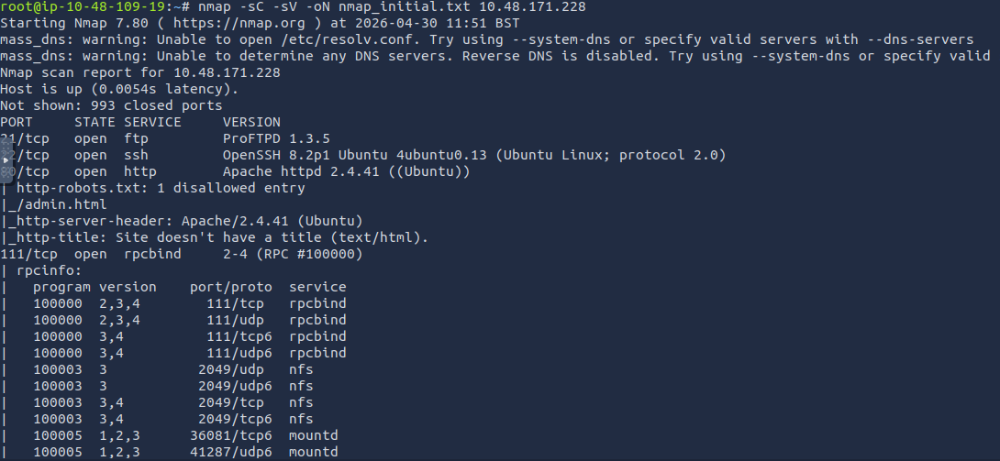

### Findings

| Port | Service | Relevance |
|------|---------|-----------|
| **21/tcp** | ProFTPD | Potential `mod_copy` target |
| **22/tcp** | SSH | Access vector after key recovery |
| **139, 445/tcp** | SMB | Anonymous share risk |
| **2049/tcp** | NFS | Exported directories may expose `/var` |

Multiple attack surfaces (FTP, SMB, NFS) increase the likelihood of chained misconfigurations.

---

## Enumeration

### SMB Share Discovery

Anonymous SMB access was verified:

```bash
smbclient -L //<TARGET_IP> -N
```

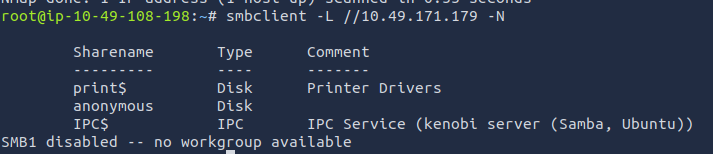

The **`anonymous`** share was accessed without credentials:

```bash
smbclient //<TARGET_IP>/anonymous
```

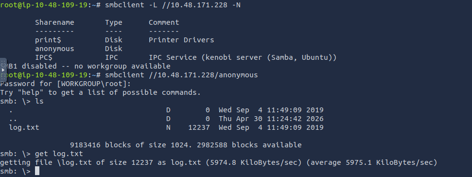

A log file **`log.txt`** was retrieved from the share. Filtering exposed ProFTPD version details:

```bash
grep -Ei "ftp|proftpd|open" log.txt
```

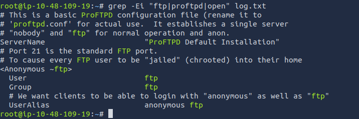

**Takeaway:** Anonymous SMB misconfiguration led to version intelligence used to select the FTP exploit path.

### NFS Export Enumeration

Exported directories were listed:

```bash
showmount -e <TARGET_IP>
```

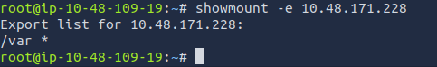

An export (e.g. `/var`) indicated that remote files could be mounted locally for offline analysis—critical for retrieving files copied into `/var/tmp` during exploitation.

### NFS Mount

The remote share was mounted to inspect `/var` contents from the attacker machine:

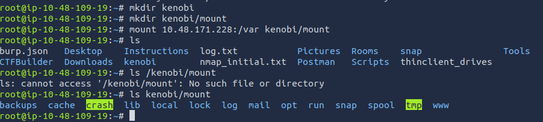

---

## Exploitation

### ProFTPD `mod_copy` — SSH Key Exfiltration

ProFTPD **1.3.5** is vulnerable to **`mod_copy`** (CVE-2015-3306), allowing arbitrary file copy via `SITE CPFR` / `SITE CPTO` without authentication in vulnerable configurations.

**Constraints:**

- `/home/kenobi/.ssh/id_rsa` was not directly readable via NFS.
- The exploit **copies** the key into **`/var/tmp`**, which is reachable through the mounted NFS export.

ProFTPD was interacted with via Netcat to copy the private key:

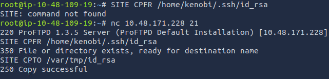

The key appeared under the mounted path:

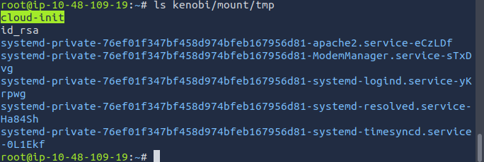

### Local Key Retrieval and SSH Access

The key was copied from the mount point, permissions were hardened, and SSH login was performed:

```bash
cp kenobi/mount/tmp/id_rsa .
chmod 600 id_rsa
ssh -i id_rsa kenobi@<TARGET_IP>
```

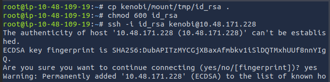

| Step | Rationale |
|------|-----------|
| `chmod 600` | SSH rejects overly permissive private keys |
| Key-based SSH | Initial access as user `kenobi` |

---

## Privilege Escalation

### SUID Enumeration

Binaries with the SUID bit set were discovered:

```bash
find / -perm -u=s -type f 2>/dev/null
```

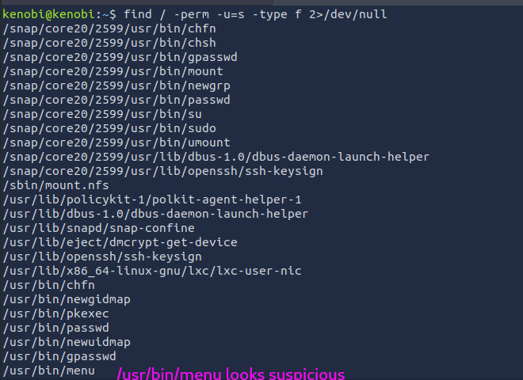

### Vulnerable Binary: `/usr/bin/menu`

The SUID binary **`/usr/bin/menu`** invoked system utilities (e.g. `ifconfig`) using **relative paths**, enabling **PATH hijacking**:

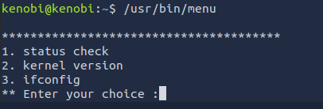

**Attack concept:**

1. Create a malicious `ifconfig` (or targeted binary) in a directory prepended to `PATH`.
2. Trigger the menu option that executes `ifconfig`.
3. The SUID process runs the attacker-controlled binary as **root**.

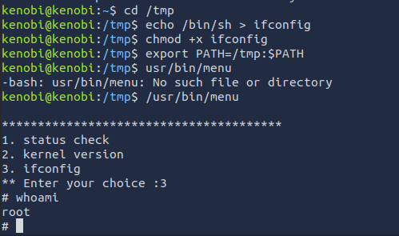

Selecting the `ifconfig` option executed the hijacked binary and yielded a **root shell**.

---

## Key Takeaways

| Vulnerability | Impact |
|---------------|--------|
| Anonymous SMB | Information disclosure (`log.txt`, service versions) |
| ProFTPD 1.3.5 `mod_copy` | Unauthenticated arbitrary file copy |
| NFS export of `/var` | Exposure of files staged in `/var/tmp` |
| SSH key on filesystem | Credential theft when combined with copy primitive |
| SUID + relative paths | Local privilege escalation to root |

**Offensive pattern:** Enumeration across SMB → NFS → FTP created a path from **unauthenticated intel** to **root shell** without password guessing.

---

## Defensive Recommendations

- Disable or restrict **anonymous SMB**; enforce authentication and least privilege on shares.
- Upgrade **ProFTPD** beyond vulnerable 1.3.5 builds; disable unused modules such as `mod_copy`.
- Limit **NFS exports** to required hosts; avoid exporting sensitive paths like `/var` broadly.
- Protect private keys with strict permissions; consider key-based access controls and rotation.
- SUID binaries must use **absolute paths** for external command invocation.
- Enable centralized logging (FTP, SMB, SSH, privilege changes) for **SOC** detection use cases.

---

## Conclusion

The **Kenobi** assessment demonstrated a realistic **multi-protocol attack chain**: SMB log disclosure, NFS-assisted file access, ProFTPD exploitation for SSH key theft, and SUID PATH hijacking for root. The lab reinforces that individual “low severity” misconfigurations become critical when chained by an attacker.

This write-up is structured for technical recruiters and hiring managers reviewing **penetration testing fundamentals**, **Linux privilege escalation**, and **clear, repeatable methodology**.

---

*For educational purposes only. Only perform penetration testing on systems you own or are explicitly authorized to test.*
