# RootMe — TryHackMe Write-up

[](https://tryhackme.com)
[](https://tryhackme.com)
[](https://tryhackme.com)

## Overview

This write-up documents a complete penetration test of the **RootMe** room on [TryHackMe](https://tryhackme.com/room/rrootme). The engagement covers web application reconnaissance, directory brute-forcing, **unrestricted file upload** bypass, reverse shell establishment, and **SUID-based** privilege escalation using Python.

The lab maps cleanly to **junior web penetration testing**, **SOC alert triage** (suspicious uploads, outbound callbacks), and internship portfolios demonstrating structured methodology from reconnaissance through root compromise.

---

## Lab Information

| Field | Details |
|-------|---------|
| **Room** | [RootMe](https://tryhackme.com/room/rrootme) |
| **Platform** | TryHackMe |
| **Target IP** | `<TARGET_IP>` (assigned per session) |
| **Attacker OS** | Kali Linux |
| **Objectives** | Gain initial access via web exploit, escalate to root, capture user and root flags |

---

## Skills Demonstrated

- Host and service discovery (**Nmap**)
- Web content discovery (**Gobuster**)
- File upload restriction bypass (**Burp Suite** Intruder)
- PHP reverse shell deployment and callback handling (**Netcat**)
- Post-exploitation file and SUID enumeration
- Privilege escalation via **GTFOBins** (Python SUID)
- Shell stabilization and flag hunting on Linux targets

---

## Tools Used

| Tool | Purpose |
|------|---------|
| **Nmap** | Port scanning and OS/service detection |
| **Gobuster** | Directory and path brute force |
| **Burp Suite** | Intercept, Intruder payload manipulation |
| **msfvenom / manual PHP shell** | Reverse shell payload generation |
| **Netcat** | Listener for incoming reverse shell |
| **GTFOBins** | Python SUID privilege escalation reference |
| **find** | Locating `user.txt` and `root.txt` |

---

## Reconnaissance

Target discovery and service enumeration were performed with:

```bash
nmap -Pn -A <TARGET_IP>
```

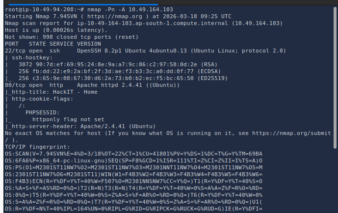

### Findings

| Port | Service | Notes |
|------|---------|-------|
| **22/tcp** | SSH | Secondary access if credentials found |
| **80/tcp** | HTTP | Primary web attack surface |

The web service on port 80 became the primary entry point for exploitation.

---

## Enumeration

### Directory Brute Force (Gobuster)

Hidden paths were discovered against the web root:

```bash
gobuster dir \
  --wordlist=/usr/share/wordlists/dirbuster/directory-list-2.3-small.txt \
  -u http://<TARGET_IP>
```

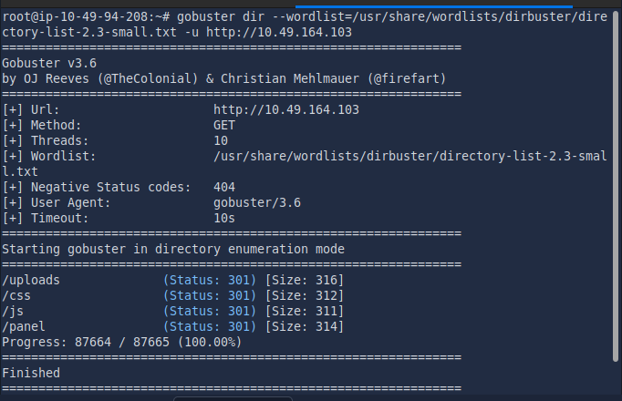

| Path | Significance |
|------|----------------|
| `/panel` | Administrative upload functionality (high value) |

The `/panel` endpoint exposed a file upload feature suitable for webshell deployment.

---

## Exploitation

### Web Application Analysis

The target web application was reviewed in the browser:

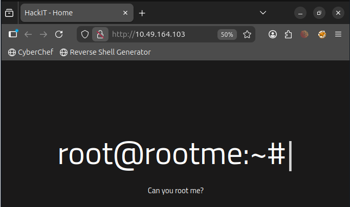

The `/panel` route provided **file upload** capability:

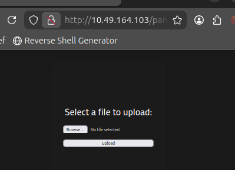

### Reverse Shell Payload

A PHP reverse shell was configured with the attacker IP and listener port (**1234**):

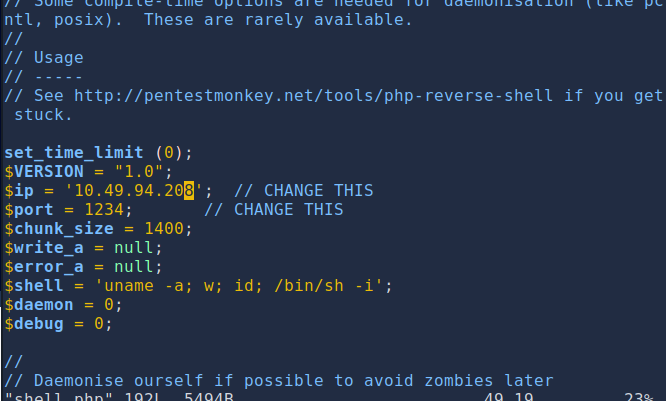

Initial upload of a `.php` shell was **rejected** by the application—indicating extension or content filtering.

### Upload Filter Bypass (Burp Suite)

**Burp Proxy** was used to intercept the upload request and send it to **Intruder**:

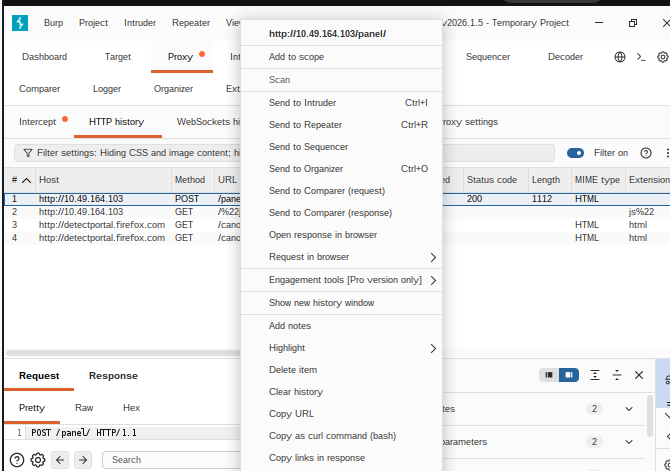

Alternative extensions were fuzzed (e.g. `.php5`, `.phtml`, `.bak`) using a **Sniper** attack on the filename:

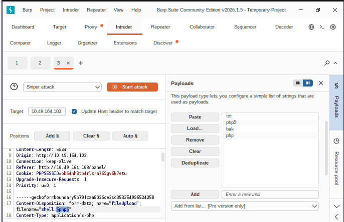

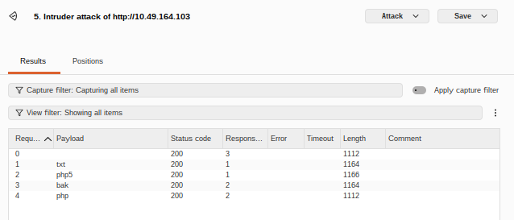

A bypass extension succeeded and the webshell was stored on the server:

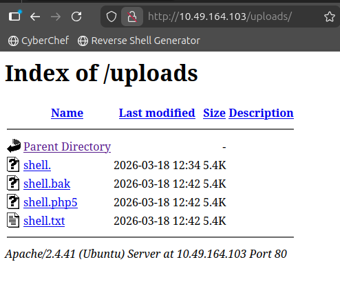

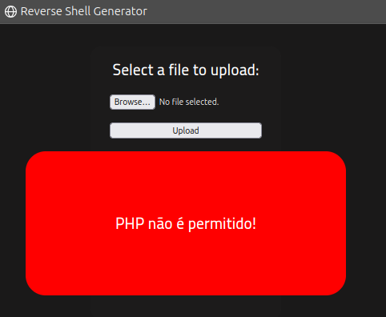

### Reverse Shell Callback

A Netcat listener was started on the attacker machine:

```bash
nc -nlvp 1234
```

The uploaded shell was triggered via HTTP (e.g. browsing to the uploaded script path), establishing a session as the web service user:

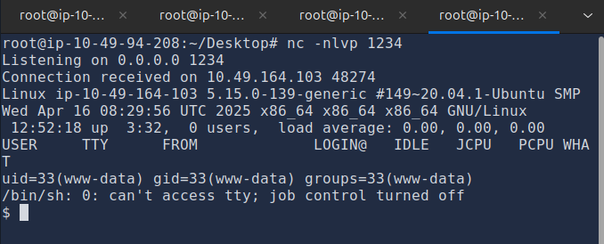

### User Flag

The user flag was located with:

```bash
find / -type f -name user.txt 2>/dev/null
```

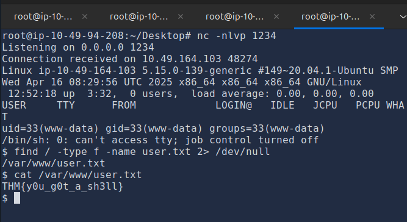

---

## Privilege Escalation

### SUID Binary Enumeration

Files owned by root with the SUID bit set were identified:

```bash
find / -type f -user root -perm -u=s 2>/dev/null
```

When executed, **SUID** binaries run with the file owner’s privileges (here, **root**).

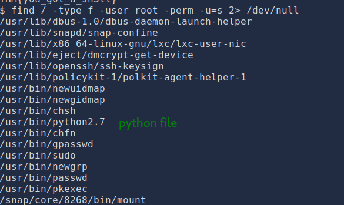

### GTFOBins — Python

[GTFOBins](https://gtfobins.github.io/gtfobins/python/) documents privilege escalation when Python carries the SUID bit. The following invokes a root shell:

```bash
python2.7 -c 'import os; os.setuid(0); os.system("/bin/sh")'
```

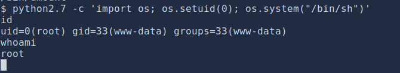

### Root Flag

After escalating to root, the root flag was retrieved:

```bash
find / -type f -name root.txt 2>/dev/null
```

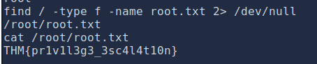

---

## Key Takeaways

| Area | Lesson |
|------|--------|
| **Upload validation** | Extension blacklists are insufficient; use allowlists, content inspection, and isolated storage. |
| **Web shells** | Successful uploads plus execution lead directly to RCE—high priority for WAF/SOC monitoring. |
| **Burp Suite** | Manual and automated tampering remains essential for bypassing weak filters. |
| **SUID binaries** | Misconfigured SUID interpreters (Python) are a common Linux privesc vector. |
| **Methodology** | Recon → enumerate → exploit → stabilize → privesc mirrors professional engagements. |

---

## Defensive Recommendations

- Implement **allowlist-based** file upload controls (type, extension, MIME, size).
- Store uploads **outside the web root** or serve them without execution permissions.
- Deploy a **WAF** and monitor for webshell patterns and anomalous `.php*` requests.
- Alert on **outbound reverse shell** traffic and new listener callbacks (**SOC** playbooks).
- Audit and remove unnecessary **SUID** binaries; never assign SUID to interpreters.
- Keep web stacks patched; restrict `/panel`-style admin paths behind strong authentication.

---

## Conclusion

**RootMe** demonstrates a full **web-to-root** attack path: **Gobuster** uncovered `/panel`, **Burp Suite** bypassed upload restrictions, a **PHP reverse shell** provided initial access, and a **SUID Python** binary enabled root. The exercise highlights why upload endpoints and SUID configurations are recurring audit priorities in penetration tests and blue-team hardening.

This documentation is formatted for **GitHub portfolio** review, **ATS-friendly** keyword coverage (Nmap, Gobuster, Burp Suite, Netcat, privilege escalation, Linux), and technical interviews for security internships and junior roles.

---

*For educational purposes only. Only perform penetration testing on systems you own or are explicitly authorized to test.*
